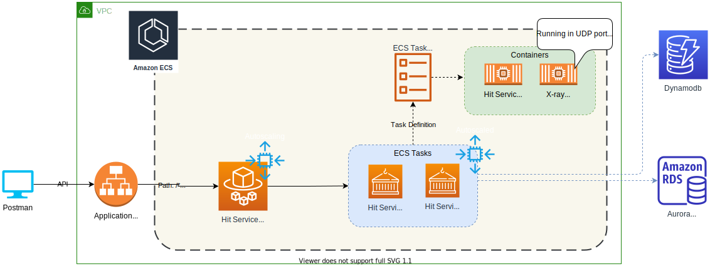

# Distributed tracing using AWS X-ray with custom segments

This article explains how to enable distributed tracing for a microservice-based on spring boot using AWS X-ray. The microservice uses Dynamodb and Aurora RDS (Mysql) for data persistence. This article will also explain see how to create custom subsegments, add annotations, and visualize them in the AWS console.

# Need for distributed tracing

Distributed tracing tracks a single request through all of its journey, from its source to its destination, unlike traditional forms of tracing which just follow a request through a single application domain. The whole process starts with the event being traced and the single request associated with it. As we follow this request, many entities within our distributed system perform operations on it. Those operations are recorded using traces, that are generated by the single original request.

Here are some applications of distributed tracing:

* Report on the health of applications and microservices to identify degraded states before a failure occurs.
* Detect unforeseen behavior that results from automated scaling, making it easier to prevent and recover from failures.
* Analyze how end-users experience the system in terms of average response times, error rates, and other digital experience metrics.
* Monitor key performance metrics that can be with interactive visual dashboards.
* Debug systems, isolate bottlenecks, and resolve code-level performance issues.
* Identify and troubleshoot unseen problems at their root.

# AWS X-ray

AWS X-Ray helps developers analyze and debug production, distributed applications, such as those built using a microservices architecture. With X-Ray, you can understand how your application and its underlying services are performing to identify and troubleshoot the root cause of performance issues and errors. X-Ray provides an end-to-end view of requests as they travel through your application, and shows a map of your application’s underlying components. You can use X-Ray to analyze both applications in development and in production, from simple three-tier applications to complex microservices applications consisting of thousands of services.

Here are some key benefits of using AWS X-ray service:

* **Review request behavior** - AWS X-Ray traces user requests as they travel through your entire application
* **Discover application issues** - With AWS X-Ray, you can glean insights into how your application is performing and discover root causes. With X-Ray’s tracing features, you can follow request paths to pinpoint where in your application and what is causing performance issues.
* **Improve application performance** - AWS X-Ray helps you identify performance bottlenecks. X-Ray’s service maps let you see relationships between services and resources in your application in real time.
* **Ready to use with AWS** - AWS X-Ray works with Amazon EC2, Amazon EC2 Container Service (Amazon ECS), AWS Lambda, and AWS Elastic Beanstalk.
* **Designed for a variety of applications** - AWS X-Ray works for both simple and complex applications, either in development or in production. You can analyze simple asynchronous event calls, three-tier web applications, or complex microservices applications consisting of thousands of services

# Sample Application

* "Website Hit Tracker" - The sample microservice is a simple website tracker built using spring boot. Here is the list of web services exposed by the microservices

| URL  | Method | Description | Sample request |
| ------------- | ------------- | ----| --- |
| /sites | POST | Creates a new entry for the given website (saves information in RDS and Dynamodb) | ```json {"url":"{{url}}", "description":"{{url}}", "ownerFirstName":"Owner first name", "ownerLastName":"Owner last name", "hostedCountry":"Hosted country", "category":"Category"}```|
| /sites | GET | Gets all sites registered in RDS  ||
| /details | GET | Get site details based on URL | /details?url={{url}} |
| /hits | PUT | Increments the hit counter by 1 for the URL | /hits?url={{url}} |
| /hits | GET | Returns number of website hits | /hits?url={{url}} |
| /sites | DELETE | Deletes site | /sites?url={{url}} |

* Datamodel for 'site' table in RDS Aurora [Mysql]

| Column name  | Type | Description | Sample |
| ------------- | ------------- | ----| ---- |
| url | string | URL/Web address (PK) | www.google.com |
| category | string | Category of the website | Search Engine |
| description | string | Description of the website | Google.com to search stuff |
| hosted_country | string | Country in which website is hosted | United States |
| owner_first_name | string | First name of the website owner | Google LLC |
| owner_last_name | string | Last name of the website owner | Google LLC |

* Datamodel for 'hits' table in Dynamodb

| Column name  | Type | Description | Sample |
| ------------- | ------------- | ----| ---- |
| url | string | URL/Web address (Partition key) | www.google.com |
| hits | number | Number of times the website has been accessed | 3 |

# Architecture

Here is the high level architecture of the system



**Notes**

* "Website Hit Tracker" microservice is deployed as an ECS Fargate service inside ECS cluster
* An application load balancer backs the ECS service
* ECS Task consists of two containers:
  * Default container - Hosts "Website Hit Tracker" microservice
  * x-ray-demon-container - Hosts Xray demon running in UDP port 2000, that collects traces and sends them periodically to AWS X-ray service
* ECS service is autoscaled using `CPUUtilization` metric with a min of 2 and max of 5 instances

The code available in this repository is exposed as a CDK Construct. To learn more about CDK Construct, click [here](https://docs.aws.amazon.com/cdk/latest/guide/constructs.html)

# Code snippets

* Enable X-ray in the spring boot application by creating a global recording and begin segment statement

```java
@Configuration
@EnableAutoConfiguration
public class WebConfig {

    private static final String SERVICE = "Hit-service";

    @Bean
    public Filter TracingFilter() {
        return new AWSXRayServletFilter(SERVICE);
    }

    // Enable Xray
    static {
        AWSXRayRecorderBuilder builder = AWSXRayRecorderBuilder.standard();
        AWSXRay.setGlobalRecorder(builder.build());
        AWSXRay.beginSegment(SERVICE);
    }
}
```

* Enable tracing for classes with `@XRayEnabled` annotation using AspectJ

```java
@Aspect
@Component
public class XRayInspector extends AbstractXRayInterceptor {

    private static final String SESSION_ID = "SessionId";
    private static final String ARGS = "Args";

    @Override
    @Pointcut("@within(com.amazonaws.xray.spring.aop.XRayEnabled)")
    public void xrayEnabledClasses() {
    }

    /**
     * Customize, annotations and data sent to X-ray
    */
    @Override
    public Object traceAroundMethods(ProceedingJoinPoint pjp) throws Throwable {
        Segment segment = AWSXRay.getCurrentSegment();
        ServletRequestAttributes attributes = (ServletRequestAttributes) RequestContextHolder.getRequestAttributes();
        if (attributes != null) {
            HttpServletRequest request = attributes.getRequest();
            Map<String, Object> annotationMap = new HashMap<>();

            // Pass input args and session ID part of segment annotation
            Optional<String> args = Arrays.stream(pjp.getArgs()).map(Object::toString).reduce((a, b) -> a + ", " + b);
            args.ifPresent(s -> annotationMap.put(ARGS, s));
            annotationMap.put(SESSION_ID, request.getSession().getId());
            segment.setAnnotations(annotationMap);
        }

        return super.traceAroundMethods(pjp);
    }

    // Customize behavior around spring data repository 
    @Override
    public Object traceAroundRepositoryMethods(ProceedingJoinPoint pjp) throws Throwable {
        return super.traceAroundRepositoryMethods(pjp);
    }
}
```

> Note: Customize the data sent to X-ray by overriding methods like `traceAroundMethods` inside `AbstractXRayInterceptor`

* Enable tracing on data source level

```java
@Bean
@ConfigurationProperties(prefix = "spring.datasource")
public DataSource dataSource() {
    DataSource dataSource = DataSourceBuilder.create()
        .driverClassName("com.mysql.cj.jdbc.Driver")
        .url("jdbc:mysql://" + System.getenv("RDS_HOSTNAME") + ":3306/hitdatabase?createDatabaseIfNotExist=true")
        .username(System.getenv("RDS_USERNAME"))
        .password(System.getenv("RDS_PASSWORD"))
        .build();

    // Data source tracing
    return new TracingDataSource(dataSource);
}
```

> Note: Make sure to return `TracingDatasource`

* Create a custom segment and add an annotation to send in additional data. Here is an example of how we did it part of `createSite()` method inside `SiteResource.java` web controller

```java
// Save subsegment
Subsegment saveSubSegment = AWSXRay.beginSubsegment("Save site details");
final Site newSite = siteRepository.save(site);
log.info("New site created {}", newSite.getUrl());
responseEntity = new ResponseEntity<>(siteRepository.save(site), HttpStatus.OK);

// Site URL sent in part of the subsegment via annotation
saveSubSegment.setAnnotations(Map.of("siteUrl", newSite.getUrl()));
AWSXRay.endSubsegment();
```

> Note: For more complex example with multiple subsegments refer to `createSite()` method inside `SiteResource.java`

# Build & Deployment

## Pre-requistes

* AWS CDK should be installed in the local laptop. You can read more about it [here](https://docs.aws.amazon.com/cdk/latest/guide/getting_started.html)
* ```Yarn``` needs to be installed, you can check the installation status by running this command
* An AWS account with console and API access

```bash
yarn version
```

**Output**

1.22.10

If ```Yarn``` is not installed run the following command

```bash
npm install -g yarn
```

## Build

Check out the code from this repository using this command:

```bash
mkdir distributed-tracing-for-containers-using-x-ray && cd distributed-tracing-for-containers-using-x-ray
git clone https://gitlab.aws.dev/am3-app-modernization-gsp/containers/distributed-tracing-for-containers-using-x-ray.git .
```

Build the Website hit tracker microservice based on spring using the following command:

```bash
cd src/xray-hit-counter
mvn clean install
cd ../..
```

> Note: Source code for 'Website hit tracker' microservice based on spring boot is available under `src\xray-hit-counter` folder

## Deploy

As the code is created as a CDK construct, the following parameters can be customized as part of the deployment

| Parameter  | Description | Default |
| ------------- | ------------- | ----|
| vpc  |  VPC in which the resources needs to be created | New VPC will be created |

> Note: CDK will take care of building the docker images for xray-demon, 'Website hit tracker' microservice and pushing it to ECR.

Code for the sample application using this construct is available in `src/integ.default.ts`. In order to deploy the application, first bootstrap a CDK environment (if you haven't done so already).

```bash
# Bootstrap CDK (ONLY ONCE, if you have already done this you can skip this part)
# Subsitute your AWS Account Id and AWS region in the command below
$ cdk bootstrap \
    --cloudformation-execution-policies arn:aws:iam::aws:policy/AdministratorAccess \
    aws://<AWS Account Id>/<AWS_REGION>
```

Run the following command to start the deployment

```bash
cdk deploy --require-approval never
```

Once the deployment is successful you will see the following output:

```bash
✅  testing-stack

Outputs:
testing-stack.XrayConstructClusterxrayloadbalancerF1426234 = testi-XrayC-1INSQS8GFHP60-1640596973.us-east-1.elb.amazonaws.com
testing-stack.XrayConstructClusterxrayrdsC8AF649E = testing-stack-xrayconstructclusterdb6e508e4b-4hahiq40psr1.cluster-cqsh75yzp1ny.us-east-1.rds.amazonaws.com
testing-stack.XrayConstructClusterxrayserviceLoadBalancerDNS4584060F = testi-XrayC-1INSQS8GFHP60-1640596973.us-east-1.elb.amazonaws.com
testing-stack.XrayConstructClusterxrayserviceServiceURLAA1D9F86 = http://testi-XrayC-1INSQS8GFHP60-1640596973.us-east-1.elb.amazonaws.com

```

> Note: The output will contain the load balancer DNS which can be used for running the integration tests

# Unit testing

Unit testcases can be executed by running the following command from the root directory

```bash
yarn test
```

```bash
yarn run v1.22.10
$ npx projen test
🤖 test | rm -fr lib/
🤖 test » test:compile | tsc --noEmit --project tsconfig.jest.json
🤖 test | jest --passWithNoTests --all --updateSnapshot
 PASS  test/index.test.ts
  ✓ create app (871 ms)

----------|---------|----------|---------|---------|-------------------
File      | % Stmts | % Branch | % Funcs | % Lines | Uncovered Line #s
----------|---------|----------|---------|---------|-------------------
All files |     100 |    71.43 |     100 |     100 |
 index.ts |     100 |    71.43 |     100 |     100 | 19-90
----------|---------|----------|---------|---------|-------------------
Test Suites: 1 passed, 1 total
Tests:       1 passed, 1 total
Snapshots:   0 total
Time:        5.579 s
Ran all test suites.
🤖 test » eslint | eslint --ext .ts,.tsx --fix --no-error-on-unmatched-pattern src test build-tools .projenrc.js
✨  Done in 17.70s.
```

# Integration testing

## Pre-requistes

All the sample test cases in this repository are based on the Postman API client, so download and install the application ([link](https://www.postman.com/product/api-client/)) before proceeding to the next step.

## Test case execution

* Import the test case collection under [postman](postman) folder inside the root directory to your postman client.
* The following variables can be customized as part of the collection's properties

| Name  | Description | Sample |
| ----- | ------------- | ----|
| baseUrl | Load balancer URL |  testi-XrayC-1INSQS8GFHP60-xxxxx.us-east-1.elb.amazonaws.com |
| url | Website address |  www.google.com |

* Run the testcases in the following order:

1. Create Site
2. All Sites
3. Site Details
4. Record Hit (run it 3 times)
5. Get Hits
6. Delete Site

After successfully executing the test case, wait for two mins and then log in to the AWS console and click on [X-ray service](https://console.aws.amazon.com/xray/home). You should see the "Service Map" updated with the details connecting "Hit-service" with "RDS" and "Dynamodb," like below:


The below image should contain the trace information that gets captured part of the `createSite()` function


# Cleanup

Run the following command from root directory to delete the stack

```bash
cdk destroy
```

# Resources

* [AWS X-Ray](https://aws.amazon.com/xray/)
* [AWS X-Ray SDK for Java](https://docs.aws.amazon.com/xray/latest/devguide/xray-sdk-java.html)
* [Running the X-Ray daemon on Amazon ECS](https://docs.aws.amazon.com/xray/latest/devguide/xray-daemon-ecs.html)
